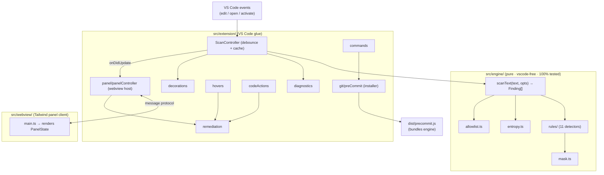
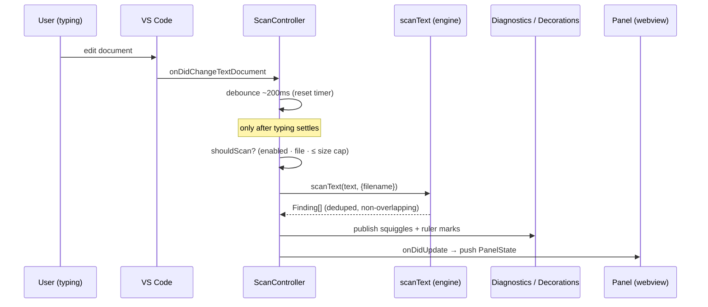
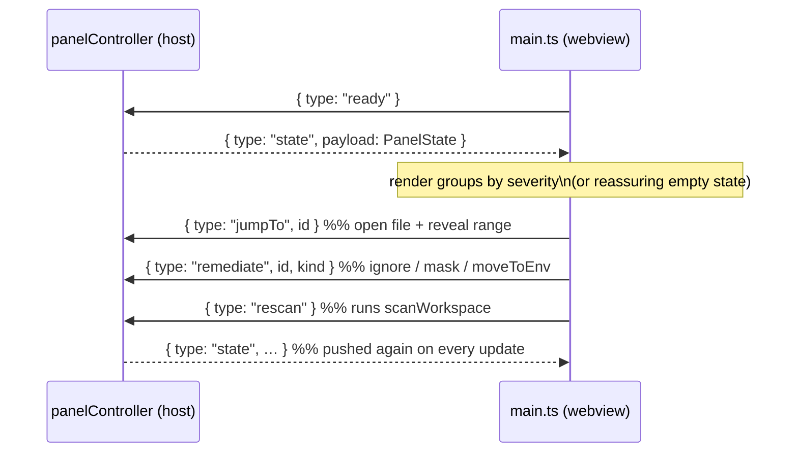
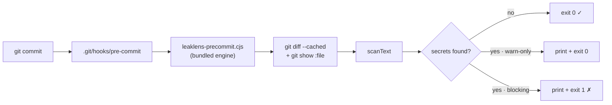

# LeakLens v1.0.0 — Architecture

Human-readable guide to how LeakLens works, with diagrams. For the rule catalogue see
[RULES.md](RULES.md); for a high-level status snapshot see [CLAUDE.md](CLAUDE.md).

## 1. The big picture

LeakLens is split into a **pure engine** (no VS Code, fully testable) and a thin **VS Code
glue** layer. The engine is the moat: it's deterministic, synchronous, and reusable (the
git hook runs the very same engine outside the editor).



**Rule (enforced):** nothing in `engine/` imports `vscode`. That single constraint keeps
detection portable, deterministic, and 100%-unit-testable without mocking the editor.

## 2. The scan data-flow (typing → squiggle)

Scanning never runs on the keystroke hot path. Edits are **debounced**; the actual scan is
a pure function call.



Inside `scanText` each rule runs a cheap keyword pre-filter, then its regex, then the
gates that protect precision:

```mermaid
flowchart LR
  A["for each rule"] --> B{keyword present?}
  B -- no --> A
  B -- yes --> C["regex matches"]
  C --> D{entropy ≥ floor?}
  D -- no --> C
  D -- yes --> F{validate ok?\n(placeholder / path)}
  F -- no --> C
  F -- yes --> G["build Finding (mask preview)"]
  G --> H["dedupe overlaps\n(most-severe wins)"]
  H --> I["drop lines with\nleaklens:ignore"]
  I --> J["Finding[]"]
```

## 3. The webview message protocol

The panel is a sandboxed webview (strict CSP, nonce'd script, no network). It knows
nothing about detection — it renders `PanelState` and emits action events. The contract
lives in [`src/extension/panel/protocol.ts`](../../src/extension/panel/protocol.ts).



`id` encodes `"<uri> <start> <end>"`, so the host can resolve any panel row back to a
precise document range for jumping or remediation.

## 4. Theming (Tailwind → VS Code)

The panel uses Tailwind utilities **only**, and every color/font token resolves to a
`--vscode-*` CSS variable (see [`tailwind.config.js`](../../tailwind.config.js)). The panel
is therefore automatically correct in light, dark, and high-contrast themes — we never
hardcode a color. Inline detection UI (squiggles, ruler marks, hovers) uses the native VS
Code APIs and `ThemeColor`, not Tailwind.

## 5. The git pre-commit guard

Opt-in and entirely local. On install, LeakLens copies the bundled `dist/precommit.js`
into `.git/hooks/leaklens-precommit.cjs` and writes a `pre-commit` shell that runs it. The
runner reads **staged** blobs via `git` and scans them with the same engine.



Commit-blocking is controlled by the `leaklens.commitBlocking` setting; when off, the guard is warn-only.

## 6. Performance budget (treated as law)

| Budget | Target | How it's protected |
|---|---|---|
| Activation | < 50ms of our code | lazy `onStartupFinished`; activate only wires listeners |
| Typical scan (<2k lines) | < 10ms | pure synchronous regex + keyword pre-filter; perf test guards it |
| Typing feel | no perceptible lag | debounced (~200ms), never scans per keystroke |
| Large files | never block UI | files over the size cap (default 2MB) are skipped |
| VSIX size | < 1MB | esbuild minified bundles, purged Tailwind, zero runtime deps |
