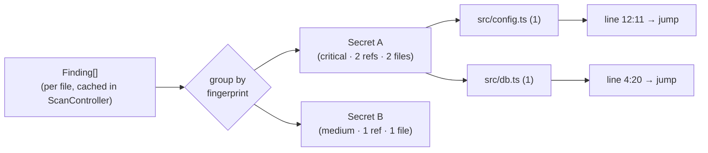
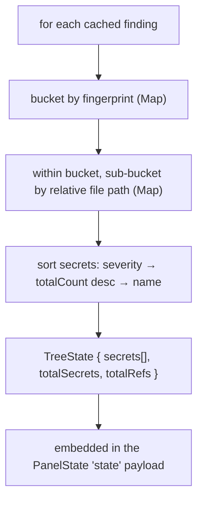
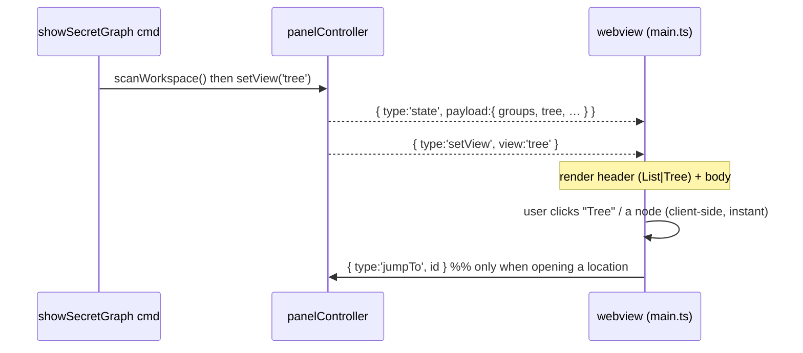

# LeakLens v1.1.0 — Architecture (Secret Graph)

Covers the **Secret Graph** added in 1.1.0. The core engine/extension/webview split and
the scan data-flow are unchanged — see [v1.0.0 ARCHITECTURE](../1.0.0/ARCHITECTURE.md).

## What it is

A second view in the Findings panel that clusters findings by the **unique secret value**
and shows every place it's referenced from:

## The fingerprint (why grouping is safe and fast)

Each `Finding` carries a `fingerprint` — a compact, deterministic, **non-reversible** hash
(cyrb53) of the *raw* matched value, computed in the pure engine
([fingerprint.ts](../../src/engine/fingerprint.ts)). Two findings are "the same secret" iff
their fingerprints match.

- **Privacy:** the raw secret is hashed in the engine and never sent to the webview — the
  panel only ever receives the fingerprint + the masked preview. (Consistent with the
  "never echo a secret" UX rule.)
- **Speed:** grouping is one `O(F)` pass over the cached findings.

## Host-side grouping (`panelController.buildTree`)

`TreeState` ships inside the same `state` message as the list view, so the webview holds
both datasets and can switch instantly.

## Toggle & render flow

**Lazy rendering:** the webview renders a node's children only when it's expanded, tracked
in an `expanded` Set persisted via `vscode.setState`. A fully collapsed tree is
`O(distinct secrets)` of DOM; expanding one secret renders just its files, expanding a file
renders just its lines. Search filters the secret list and auto-expands matches.

## Contract additions (the only protocol growth)

- `Finding.fingerprint: string` (engine).
- `protocol.ts`: `PanelView`, `TreeOccurrence`, `TreeFileNode`, `TreeSecretNode`,
  `TreeState`, `PanelState.tree`, and `HostToPanel = … | { type:'setView'; view }`.
- `PanelToHost` is **unchanged** — tree leaves reuse the existing `jumpTo` id
  (`"<uri> <start> <end>"`).

## Theming & constraints (unchanged guarantees)

Tailwind utilities only, all mapped to `--vscode-*` variables (correct in light/dark/
high-contrast). Strict CSP and nonce'd script preserved. No network, no detection logic in
the webview. Local-only and zero-cost principles untouched — this is a pure re-visualization
of data already computed locally.
